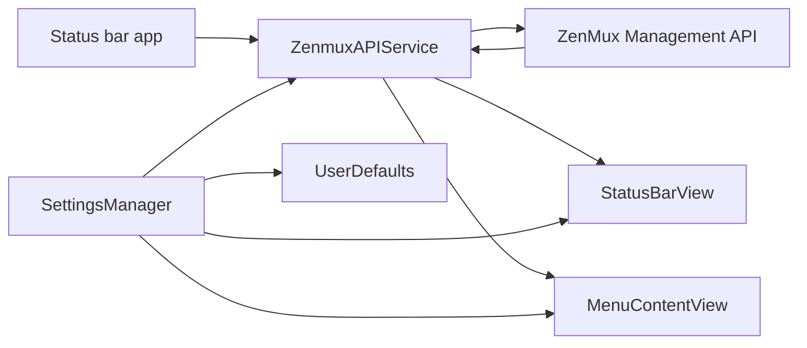

# Quotax

<p align="center">
  <strong>A lightweight macOS menu bar monitor for ZenMux subscription quotas.</strong>
</p>

<p align="center">
  
  
  
</p>

<p align="center">
  <a href="README.md">English</a> · <a href="README_zh.md">简体中文</a>
</p>

Quotax sits in the macOS status bar and keeps ZenMux quota usage visible without opening the management portal. It fetches subscription data from the ZenMux Management API, displays 5-hour and 7-day quota percentages in the menu bar, and provides a compact detail panel for quota windows, monthly limits, refresh status, and errors.

> [!NOTE]
> This repository is source-first. There is no Swift Package manifest or Xcode project; `scripts/build.sh` compiles the app directly with `swiftc`.


## Features

- Shows 5-hour and 7-day quota percentages directly in the macOS menu bar.
- Displays detailed 5-hour, 7-day, and monthly quota cards in a SwiftUI menu panel.
- Supports manual refresh and automatic refresh with a configurable interval.
- Stores the ZenMux Management API key and preferences in `UserDefaults`.
- Supports launch at login through `ServiceManagement`.
- Lets users choose used-percentage or remaining-percentage status bar display.
- Formats reset and expiry times using a user-selected time zone.

## Requirements

- macOS 15.7 or later.
- Xcode Command Line Tools or a macOS toolchain that provides `/usr/bin/swiftc`.
- A ZenMux Management API key from <https://zenmux.ai/platform/management>.

## Install

### Install via Homebrew (macOS)

```bash
brew tap tiylabs/tap
brew install --cask quotax
```

To upgrade later:

```bash
brew upgrade quotax
```

## Build and Run

```bash
chmod +x scripts/build.sh
./scripts/build.sh
open build/Quotax.app
```

To build for a specific architecture:

```bash
ARCH=arm64 ./scripts/build.sh
ARCH=x86_64 ./scripts/build.sh
```

The build script recursively collects Swift files under `Sources/`, copies `Info.plist` and `Resources/AppIcon.icns`, lints the packaged plist, ad-hoc signs the app, and writes `build/Quotax.app`.

## Usage

1. Launch `build/Quotax.app`.
2. If no API key is saved, Quotax opens the settings window automatically.
3. Paste your ZenMux Management API key and click **Save**.
4. Use the menu bar item to view quota details, refresh data, open settings, or quit.

Preferences include auto refresh, refresh interval, launch at login, status bar quota mode, and time zone.

## Project Structure

```text
Sources/
  main.swift                    App entry point
  Core/
    AppConstants.swift          App-wide constants
    AppLog.swift                OSLog categories
    AppResources.swift          App icon and resource loading helper
  Services/
    LaunchAtLoginService.swift  Launch-at-login integration
    Models.swift                Decodable subscription/quota models
    SettingsManager.swift       Persisted preferences
    ZenmuxAPIClient.swift       Low-level Management API client
    ZenmuxAPIService.swift      Refresh state and error handling
  UI/
    AppDelegate.swift           AppKit lifecycle, status item, menus, settings window
    StatusBarView.swift         Custom menu bar quota drawing
    Views.swift                 SwiftUI menu and settings UI
Resources/
  AppIcon.icns                  App icon
  DmgBackground.png             DMG installer background source image
Info.plist                      Bundle metadata and macOS settings
scripts/
  build.sh                      Direct swiftc build script
  create-dmg.sh                 Styled DMG packaging script
.github/workflows/              Release build, signing, notarization, and upload workflow
```

## How It Works



`AppDelegate` creates the status item, starts auto refresh, and opens settings when no API key exists. `ZenmuxAPIService` performs authenticated API requests and publishes subscription data, loading state, and user-readable errors. UI components observe the service and settings to redraw the menu bar and menu panel.

## Debugging Logs

Quotax uses macOS Unified Logging through `OSLog`; it does not write a custom log file. The logging subsystem is `com.zenmux.quotax`, with categories such as `lifecycle`, `network`, `refresh`, `decode`, and `settings`.

Stream live logs while reproducing an issue:

```bash
log stream --predicate 'subsystem == "com.zenmux.quotax"' --info --debug
```

Inspect recent historical logs:

```bash
log show --predicate 'subsystem == "com.zenmux.quotax"' --last 1h
```

Filter network-only logs:

```bash
log stream --predicate 'subsystem == "com.zenmux.quotax" && category == "network"' --info --debug
```

`URLError.cancelled` / `-999 cancelled` usually means an in-flight refresh request was intentionally cancelled by a newer refresh or app shutdown. Treat it as a cancellation signal instead of a fatal network failure unless it is followed by crash or termination logs.

## Development Notes

- Keep Swift files focused by responsibility and follow the existing four-space indentation style.
- UI coordination currently runs on the main actor; preserve `@MainActor` where state is shared with AppKit or SwiftUI.
- There is no automated test target yet. For changes, run `./scripts/build.sh` and manually verify the status item, settings, API key persistence, refresh behavior, and error messages.

## Releases

`.github/workflows/release.yml` builds release assets on tag pushes such as `v1.2.3`. The workflow updates bundle versions from the tag, builds x86_64 and arm64 apps, signs, notarizes, staples, packages, and uploads zipped artifacts. Signing and notarization require GitHub Actions secrets for Apple credentials.

## Acknowledgements

Quotax is inspired by [zenmux-monitor](https://github.com/jianxing-chen/zenmux-monitor). Thanks to the project for the idea and reference.

## License

Quotax is licensed under the [Apache License 2.0](LICENSE).

