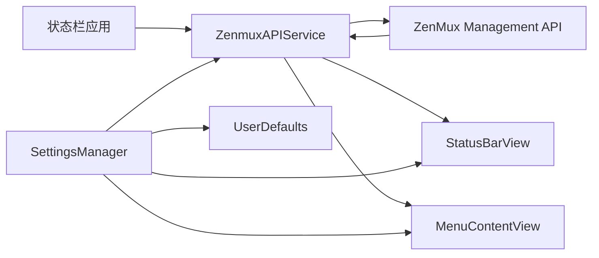

# Quotax

<p align="center">
  <strong>一个轻量级 macOS 菜单栏应用，用于监控 ZenMux 订阅额度。</strong>
</p>

<p align="center">
  
  
  
</p>

<p align="center">
  <a href="README.md">English</a> · <a href="README_zh.md">简体中文</a>
</p>

Quotax 驻留在 macOS 状态栏中，让你无需打开管理后台也能查看 ZenMux 额度使用情况。它通过 ZenMux Management API 拉取订阅数据，在菜单栏显示 5 小时与 7 天额度百分比，并在紧凑面板中展示额度窗口、月度限制、刷新状态和错误信息。

> [!NOTE]
> 本仓库是源码优先项目。当前没有 Swift Package manifest 或 Xcode project；`build.sh` 会直接使用 `swiftc` 编译应用。

## 功能特性

- 在 macOS 菜单栏直接显示 5 小时与 7 天额度百分比。
- 在 SwiftUI 菜单面板中展示 5 小时、7 天和月度额度卡片。
- 支持手动刷新，以及带可配置间隔的自动刷新。
- 使用 `UserDefaults` 保存 ZenMux Management API Key 和偏好设置。
- 通过 `ServiceManagement` 支持开机登录时启动。
- 支持选择菜单栏显示“已用百分比”或“剩余百分比”。
- 按用户选择的时区格式化重置时间和过期时间。

## 环境要求

- macOS 15.7 或更高版本。
- Xcode Command Line Tools，或提供 `/usr/bin/swiftc` 的 macOS 工具链。
- 来自 <https://zenmux.ai/platform/management> 的 ZenMux Management API Key。

## 构建与运行

```bash
chmod +x build.sh
./build.sh
open build/Quotax.app
```

指定架构构建：

```bash
ARCH=arm64 ./build.sh
ARCH=x86_64 ./build.sh
```

构建脚本会编译 `Sources/*.swift`，复制 `Info.plist` 与 `Resources/AppIcon.icns`，校验打包后的 plist，进行 ad-hoc 签名，并输出 `build/Quotax.app`。

## 使用方式

1. 启动 `build/Quotax.app`。
2. 如果尚未保存 API Key，Quotax 会自动打开设置窗口。
3. 粘贴 ZenMux Management API Key，然后点击 **Save**。
4. 通过菜单栏项目查看额度详情、刷新数据、打开设置或退出应用。

可配置项包括自动刷新、刷新间隔、登录时启动、菜单栏额度显示模式和时区。

## 项目结构

```text
Sources/
  main.swift              应用入口
  AppDelegate.swift       AppKit 生命周期、状态栏项目、菜单和设置窗口
  AppResources.swift      应用图标与资源加载辅助逻辑
  StatusBarView.swift     自定义菜单栏额度绘制
  Views.swift             SwiftUI 菜单与设置界面
  ZenmuxAPIService.swift  Management API 刷新与错误处理
  Models.swift            订阅和额度数据模型
  SettingsManager.swift   持久化偏好设置与登录启动配置
Resources/
  AppIcon.icns            应用图标
Info.plist                Bundle 元数据与 macOS 设置
build.sh                  直接调用 swiftc 的构建脚本
.github/workflows/        Release 构建、签名、公证和上传流程
```

## 工作原理



`AppDelegate` 创建状态栏项目、启动自动刷新，并在缺少 API Key 时打开设置窗口。`ZenmuxAPIService` 发起带认证的 API 请求，并发布订阅数据、加载状态和用户可读的错误信息。界面组件观察服务与设置状态，并据此重绘菜单栏和菜单面板。

## 开发说明

- 保持 Swift 文件职责清晰，并沿用当前四空格缩进风格。
- 当前 UI 协调逻辑运行在 main actor 上；涉及 AppKit 或 SwiftUI 共享状态时应保留 `@MainActor`。
- 目前没有自动化测试目标。修改后请运行 `./build.sh`，并手动验证状态栏项目、设置窗口、API Key 持久化、刷新行为和错误提示。

## 发布

`.github/workflows/release.yml` 会在推送 `v1.2.3` 这类 tag 时构建发布产物。工作流会根据 tag 更新 bundle 版本，构建 x86_64 与 arm64 应用，完成签名、公证、staple、打包并上传 zip 文件。签名与公证依赖 GitHub Actions 中配置的 Apple 凭据 secrets。

## 致谢

Quotax 受 [zenmux-monitor](https://github.com/jianxing-chen/zenmux-monitor) 项目启发而构建，感谢该项目提供的思路与参考。

## 许可证

Quotax 使用 [Apache License 2.0](LICENSE) 开源。

